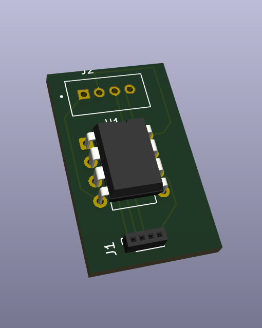

# attiny45-self-cap-touch-i2c
A pocket-sized, 3.3 V capacitive-touch sensor board built around the ATtiny45/85.  
Four independent touch pads (PB1/PB3/PB4/PB5) wake on finger proximity and report touch events to a host (Raspberry Pi, Arduino, ESP32 …) over standard I²C.  
Hardware is open-source: KiCad 9 project with 1-layer PCB, 15.5mm×16mm, easy to hand-solder.

